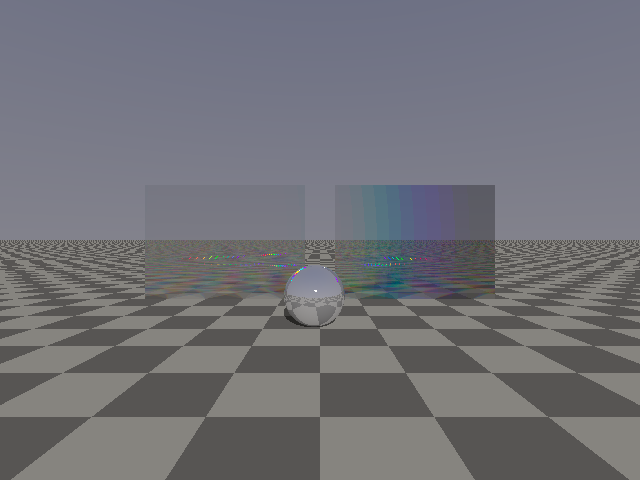
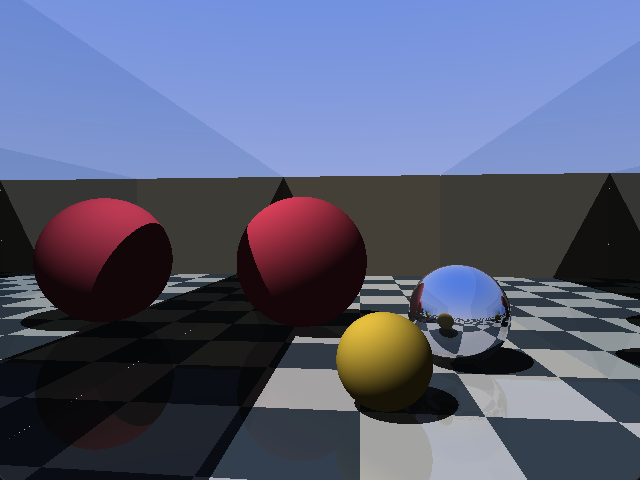
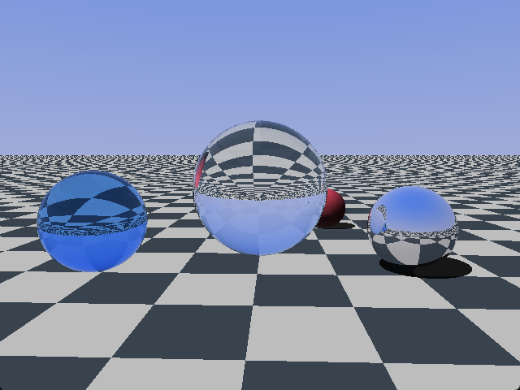
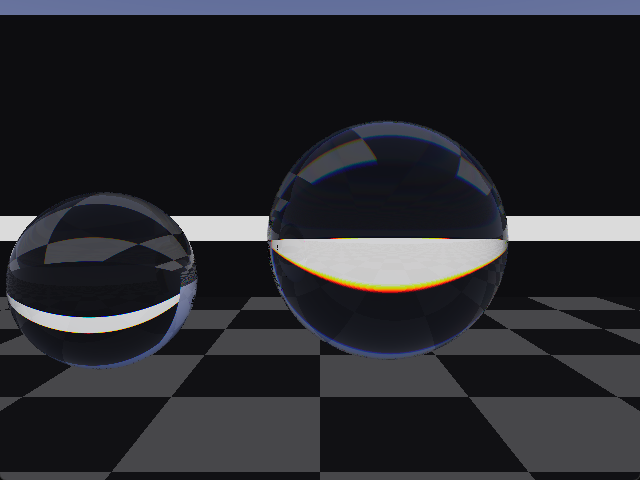
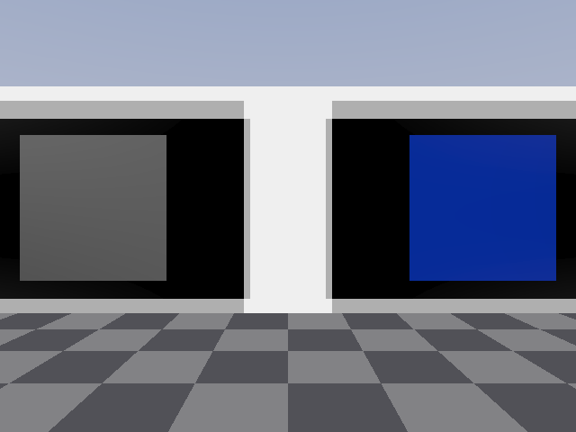
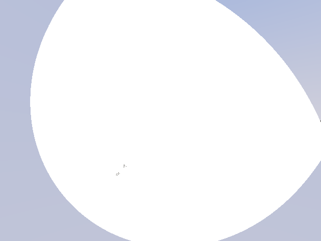
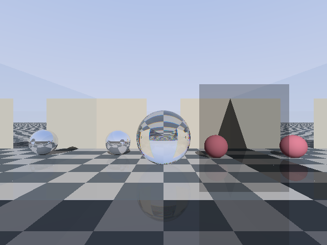

# hologram

An optics-first 3D game engine by [magmacrunch media](https://magmacrunch.com):
a real-time spectral ray tracer where light obeys physics. Mirrors reflect
recursively, prisms cast real spectra, polarizers extinguish at the angles
Malus says they should, paraboloids focus at R/2, and diffraction gratings
throw their orders by the conical grating equation. The renderer traces
wavelengths rather than RGB triples, carries a polarization state on every
ray, and meets every surface in closed form.

Named after the Dag Henderson track "hologram of a dream", published by
magmacrunch music.

Current version: **0.1.0** (see [CHANGELOG.md](CHANGELOG.md)). The full
reference lives in the [wiki](https://github.com/magmacrunchmedia/hologram/wiki).



## What it does that other engines don't

Every effect below is computed from the physics rather than approximated by a
shader trick, and every one is pinned by a host test against its closed-form
answer.

| | |
|---|---|
| **Recursive mirrors.** Facing mirrors produce a true infinite corridor to any depth, at any viewing angle. Screen-space reflection structurally cannot draw this frame; it can only reflect what is already on screen. |  |
| **Glass by the Fresnel equations:** the real pair, s and p computed separately, not Schlick's fit. Refraction, total internal reflection, and reflectance that rises toward grazing incidence because physics says so rather than because a parameter does. |  |
| **Spectral light.** Twelve wavelengths per pixel, each refracting at its own Cauchy `n(λ)`, folded to sRGB through the CIE 1931 colour matching functions. Crown glass fringes gently; flint tears the same edge into a spectrum five times wider, which is why camera lenses pair the two. |  |
| **Polarization.** Every ray carries a Stokes vector; every interface applies a Mueller matrix. Crossed polarizers go black, a third at 45° between them brings back exactly one eighth, and a waveplate writes interference colour because its retardance runs as 1/λ. |  |
| **Curved mirrors as optics quotes them:** apex, axis, vertex radius of curvature, conic constant, rim. Stand at a paraboloid's focus and every zone of the dish reflects your eye into the sun, so the whole aperture flashes. A solar furnace, from the inside. |  |
| **Diffraction gratings** in the conical (off-plane) vector form. The groove component of the direction is conserved, the dispersion component picks up `mλ/d`, and `m = 0` falls out as exact specular. Orders sweep across a ruled panel as you walk, the way a CD tilts its colours. |  |

## Why a ray tracer

The games this engine exists for (starting with Crystal Mirror Maze) are built
entirely from analytic primitives: planes, rectangles, spheres, conics. They
are rendered at low resolution by design. Closed-form intersections at 640×480
are exactly the workload a fullscreen-shader ray tracer can afford in real
time, and a tracer is the only renderer in which curved mirrors, refraction,
dispersion and polarization are *correct* rather than faked.

## Building

Requires Visual Studio (MSVC). No other dependencies; sokol is vendored.

```
build.bat          # builds every example into build\
build.bat test     # builds and runs the host tests
```

Run the examples from the repository root, since they read
`shaders\trace.hlsl` at startup. You can edit the tracer and relaunch without
recompiling.

## The examples

Each milestone left a runnable demo behind. Every GPU example accepts
`--diff`, which renders the same frame through the CPU tracer and compares
(see [The oracle](#the-oracle) below); the exit code is the verdict. They also
accept `--dump`, which writes that comparison's inputs out for `tools/gldiff`.

| | |
|---|---|
| `m0_window` | A window, a fullscreen quad, uniforms arriving every frame. |
| `m1_cpu` | The CPU tracer's first picture, written to `build\m1_cpu.ppm`. |
| `m2_gpu` | The same scene traced on the GPU, held to the oracle. |
| `m3_mirrors` | Facing mirror walls, a chrome sphere, a polished floor, all recursing. |
| `m4_glass` | A ball lens holding the checker floor upside down inside it. |
| `m5_spectral` | Crown and flint glass in front of one white stripe. |
| `m6_polarization` | The three-polarizer paradox, and a waveplate's interference colour. |
| `m7_room` | **The vertical slice:** a room of mirrors, glass, a polarizer and a flint ball that you walk through in first person. |
| `m8_furnace` | A paraboloid with its focus at eye height on the path. Walk into it. |
| `m9_spectrum` | Two ruled gratings throwing the sun's orders back at you. |

`m7_room`, `m8_furnace` and `m9_spectrum` are interactive: click to capture the
mouse, `WASD` to walk, `Space` to jump, `T` to toggle spectral tracing, `Escape`
to release the mouse.



## Architecture

- **C99 engine, one tracer in three dialects** (HLSL for D3D11, GLSL for GL
  and GLES3/WebGL2, MSL for Metal), on [sokol](https://github.com/floooh/sokol)
  (vendored, zlib licence) for the window, GPU device and swapchain. Only the
  D3D11 path has shipped: the GLSL tracer is oracle-green under WebGL2, and
  the Metal one has not yet met a Metal device.
- **The tracing runs on the GPU** as a fullscreen-quad fragment shader over a
  scene of analytic primitives delivered in one uniform block.
- **Fixed-timestep simulation** (`source/timestep.c`, ported verbatim from
  [magnolia](https://github.com/magmacrunchmedia/magnolia)).

Games compile the engine's sources directly, magnolia-style; there is no
library build and no package registry. A game is three callbacks and a scene.

### The oracle

`source/cpu_trace.c` is a complete second tracer in plain C, and the three
shaders under `shaders/` are its statement-for-statement twins. The C is
allowed to be slow and obliged to be right: every optical law lands there
first, held by host tests to closed-form answers, and then
`holo_oracle_diff()` reads the presented GPU frame back and compares it to a
CPU render of the same camera.

That diff is the engine's central correctness mechanism. A change that lands
in one tracer and not the others stops being a mystery and becomes a failing
exit code. The bar is a mean error under 1/255 with under 0.75% of pixels off
by more than 8/255.

Each cell below is that pair: mean error in 1/255 levels, then the share of
pixels off by more than 8/255. Every one passes.

| example | what it puts under the light | HLSL on D3D11 | GLSL in WebGL2 |
|---|---|---|---|
| `m2_gpu` | spheres, checker floor, the RGB walk | 0.1030 · 0.001% | 0.1033 · 0.001% |
| `m3_mirrors` | facing mirrors recursing | 0.0480 · 0.001% | 0.0482 · 0.001% |
| `m4_glass` | Fresnel, refraction, total internal reflection | 0.1161 · 0.163% | 0.1603 · 0.163% |
| `m5_spectral` | twelve wavelengths, Cauchy dispersion | 0.1183 · 0.503% | 0.2512 · 0.498% |
| `m6_polarization` | Stokes vectors, Mueller matrices, a waveplate | 0.0608 · 0.015% | 0.0657 · 0.015% |
| `m7_room` | all of the above at once, spectrally | 0.0835 · 0.231% | 0.1981 · 0.238% |
| `m8_furnace` | conic dishes, focusing at R/2 | 0.0185 · 0.022% | 0.0266 · 0.022% |
| `m9_spectrum` | gratings, conical orders | 0.0949 · 0.025% | 0.0974 · 0.025% |

The outlier percentages track each other almost exactly, which is the column
worth reading: it says both tracers take the same branches and cull the same
rays. The means run higher under WebGL2 only where twelve wavelengths give
float noise room to accumulate.

**What has actually been run.** The table above is the whole of it; the rest
of the porting work is written but unproven, and should be read that way.

| path | state |
|---|---|
| HLSL tracer, D3D11 readback | green, eight of eight |
| GLSL tracer | green, eight of eight, through `tools/gldiff` |
| GL readback (`glReadPixels`) | written; no GL host has run it |
| MSL tracer | type-checks under `tools/metalcheck`; no Metal device has seen it |
| Metal readback | written; never compiled -- it sits behind `#elif SOKOL_METAL` |
| `build.sh` (Linux, macOS) | syntax-checked; never executed |

The catch is that a readback needs the backend it runs on, and only the D3D11
one has ever run -- so on Windows the GL tracer cannot be held to the oracle
by `--diff` at all. `tools/gldiff` closes that gap.
Every example that accepts `--diff` also accepts `--dump`, which writes the
uniform block exactly as the shader receives it alongside the CPU's frame;
`tools/gldiff/gldiff.html` then renders `shaders/trace.glsl` in a WebGL2
context and compares, using the same arithmetic and the same bars, and draws
the two frames and their difference side by side.

```
build\m7_room.exe --dump
python -m http.server 8731 --bind 127.0.0.1
```

then open `http://127.0.0.1:8731/tools/gldiff/gldiff.html?s=m7_room`. It is
not a substitute for running `--diff` natively on the backend you ship, which
also exercises sokol's plumbing and the real driver -- but it catches the
tracer's own bugs, which is most of them.

The Metal tracer has no such luxury: off macOS it can be neither compiled nor
run. `tools/metalcheck` gets what it can. MSL is a C++14 dialect, so the file
is type-checked by an ordinary host compiler against a `metal_stdlib`
stand-in:

```
python tools/metalcheck/metalcheck.py
```

That validates names, arities and types -- it will catch a `params` argument
dropped from one of the six functions that take one, which is the mistake the
port is likeliest to make. It says nothing about the Metal attributes, the
linkage between the two stages, or whether the shader renders. Those need a
Mac, and until one has run `--diff` the Metal tracer should be read as
unproven.

### Engine modules

Pure arithmetic is split from platform calls so the arithmetic is host
testable, the discipline magnolia's `timestep.c` was extracted for.

| Module | |
|---|---|
| `linalg.c` | Vectors, and the optics that is vector arithmetic: reflection, Snell refraction, the Fresnel equations, the grating equation. |
| `polar.c` | Stokes rows, Mueller matrices, Fresnel amplitudes with the TIR phase. |
| `spectrum.c` | Wavelength samples, Cauchy dispersion, CIE colour matching. |
| `geometry.c` | Rays against spheres, planes, rectangles and conic dishes. |
| `camera.c` | The camera as a ray generator. |
| `cpu_trace.c` | The reference tracer, the oracle. |
| `gpu_scene.c` | The scene as the shader's uniform block. |
| `collision.c` | Capsule-vs-walls walking with gravity. |
| `timestep.c` | Fixed-step accumulator (ported from magnolia). |
| `display.c` | The only file that talks to sokol: window, device, quad, uniforms, frame readback. |
| `input.c` | Keys held and mouse look, folded per frame. |
| `oracle.c` | The GPU-vs-CPU frame diff. |

## Testing

```
build.bat test
```

**313 checks across 8 suites**, each test a standalone binary. They assert
physics, not pixels: Snell's angles into n=1.5 glass, the 41.81° critical
angle, 4% reflectance at normal incidence, a vanishing p-component at
Brewster's angle, Malus's law at five angles, the three-polarizer paradox to
the exact eighth, BK7's Abbe number computing to its catalogue 64, a
paraboloid focusing every zone at R/2, an ellipsoid imaging focus onto focus,
Littrow retroreflection, and the conical invariant.

The one exception is `test_gpu_layout.c`, which asserts bookkeeping rather
than optics: the GLSL tracer reads the scene by slot number out of one `vec4`
array, and that slot map is a hand-written copy of `HoloGpuScene`'s layout
which no compiler checks. The test parses the shader and holds every slot to
`offsetof`, so reordering the struct fails a test instead of quietly making
the GPU read the camera out of the sun.

## Constraints worth knowing

The GPU walk is **chain and fork**: each ray walks as a chain, every surface
continuing in place and forking *at most one* side branch onto the stack. One
push per interaction is a hard ceiling, because fxc (D3D11's shader compiler)
silently corrupts the walk's stack arrays when a single branch pushes twice.
Per-grating data also cannot live in dynamically indexed constant-buffer
arrays for the same reason, so the grating constants sit in scalar uniform
slots instead. The CPU tracer mirrors the structure exactly, which keeps the
oracle diff meaningful. See
[Shader constraints](https://github.com/magmacrunchmedia/hologram/wiki/Shader-constraints)
in the wiki for the full account.

## Not in the engine, by design

No editor, no ECS, no general physics engine, no mesh import, no skinned
animation, no GUI toolkit. Neither target game needs any of them, and each
would cost more than it returns. Scenes are built in code from primitives;
collision is a capsule against axis-aligned walls.

## Dependencies

[sokol](https://github.com/floooh/sokol) (`sokol_app`, `sokol_gfx`,
`sokol_glue`, `sokol_log`) by Andre Weissflog, vendored under
`external/sokol/` and used under the zlib licence.

## License

[PolyForm Noncommercial 1.0.0](LICENSE): read it, learn from it, build on it,
play with it. Any noncommercial purpose is permitted, and commercial use is
reserved to magmacrunch media (ask about a commercial licence). See
[NOTICE](NOTICE) for the exact boundary. This differs deliberately from
magmacrunch's Apache-2.0 2D engines: those are infrastructure for anyone,
while hologram is the optics engine under magmacrunch's own games. Vendored
sokol headers keep their zlib licence (`external/sokol/LICENSE`).
